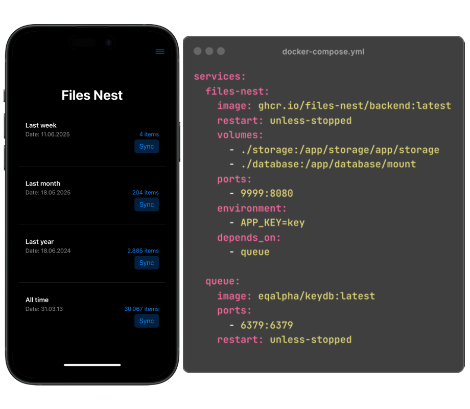
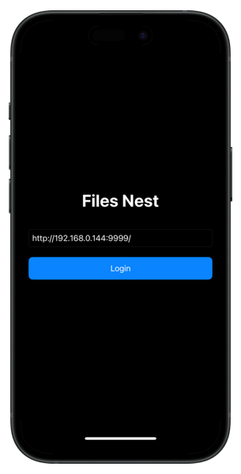
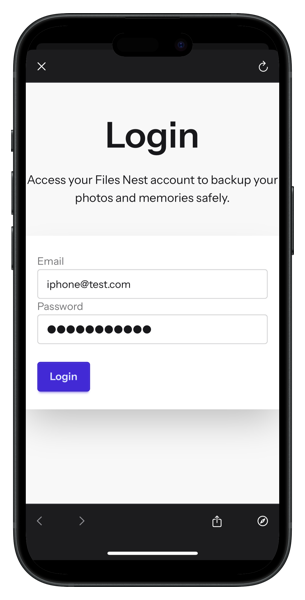
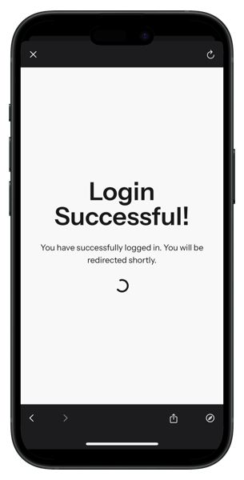

# FilesNest

`A featureless, self-hosted iCloud photos and videos backup.`

## 👋🏻 Getting Started

> \[!IMPORTANT]
>
> This project is still at a very early stage. Use it at your own risk! **Star Us** to receive notifications about new bugfixes and features from GitHub ⭐️

As mentioned before FilesNest has only one feature - uploading your photos and images from iCloud to your server.

### Step-by-step guide

1. Join our closed beta test.
https://tally.so/r/w7Ovv9
2. As soon as you get access install the TestFlight, and FilesNest iOS app.
3. Set up your server https://github.com/files-nest/backend?tab=readme-ov-file#self-hosting
4. Create a user https://github.com/files-nest/backend?tab=readme-ov-file#create-a-user
5. Login in the app.
6. Sync 🔥

## How to

In-app Login

1. Enter your server URL
2. Enter your email and password
3. Success 🎉

